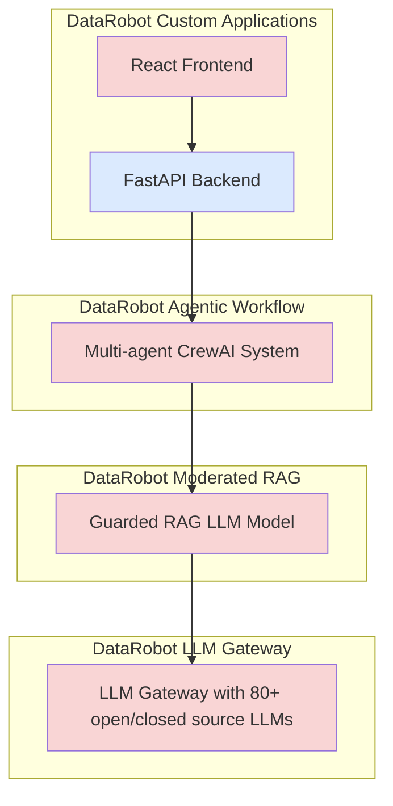
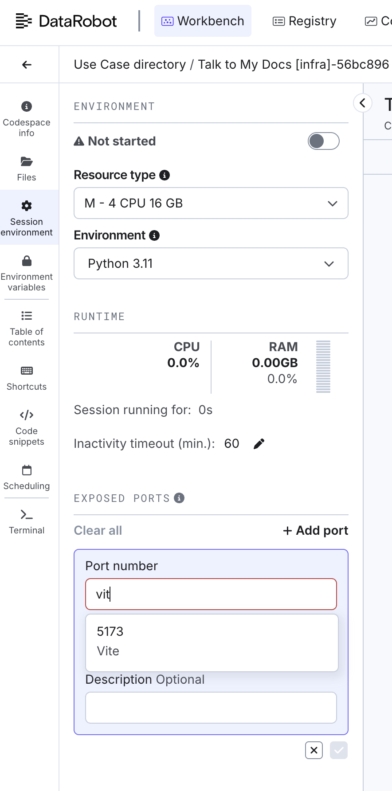

# Talk to My Docs

A modular,application template for building, developing, and deploying an AI-powered applications with multi-agent orchestration, modern web frontends, and robust infrastructure-as-code to dynamically talk to your documents across different providers such as Google Drive, Box, and your local computer.

> **Warning**
> This template is a starting point. You must adapt it for your business requirements before deploying to production.

---

## Table of Contents

1. [Quick Start](#quick-start)
2. [Architecture Overview](#architecture-overview)
3. [Development Workflow](#development-workflow)
4. [Deployment](#deployment)
5. [Subproject Documentation](#subproject-documentation)
6. [Advanced Usage](#advanced-usage)
7. [Additional Resources](#additional-resources)

---

## Quick Start

### Prerequisites

If you are using DataRobot Codespaces, this is already complete for you. If not, install the following tools:

- [Taskfile.dev](https://taskfile.dev/#/installation) (task runner)
- [uv](https://docs.astral.sh/uv/getting-started/installation/) (Python package manager)
- [Pulumi](https://www.pulumi.com/docs/iac/download-install/) (infrastructure as code)


#### Example Installation Commands

For the latest and most accurate installation instructions for your platform, visit:
* https://taskfile.dev/installation/
* https://www.pulumi.com/docs/iac/download-install/
* https://docs.astral.sh/uv/getting-started/installation/

We provide the instructions below to save you a context flip, but you're system may not meet the common expectations from these shortcut scripts:

**macOS:**
```sh
brew install go-task/tap/go-task
brew install uv
brew install pulumi/tap/pulumi
```

**Linux (Debian/Ubuntu/DataRobot Codespaces):**
```sh
# Taskfile.dev
sh -c "$(curl --location https://taskfile.dev/install.sh)" -- -d -b ~/.local/bin
# uv
curl -Ls https://astral.sh/uv/install.sh | sh
# Pulumi
curl -fsSL https://get.pulumi.com | sh
```

**Windows (PowerShell):**
```powershell
# Taskfile.dev
winget install --id=GoTask.GoTask -e
# uv
winget install --id=astral-sh.uv  -e
# Pulumi
winget install pulumi
winget upgrade pulumi
```

### Clone the Repository

```sh
git clone https://github.com/datarobot-community/talk-to-my-docs-agent
cd talk-to-my-docs-agent
```

### Environment Setup

Copy the sample environment file and fill in your credentials:

```sh
cp .env.sample .env
# Edit .env with your API keys and secrets
```

The `task` commands will automatically read the `.env` file directly to ensure each task gets the correct configuration.
If you need to source those variables directly into your shell you can:

**Linux/macOS:**
```sh
set -a && source .env && set +a
```

**Windows (PowerShell):**
```powershell
Get-Content .env | ForEach-Object {
	if ($_ -match '^\s*([^#][^=]*)=(.*)$') {
		[System.Environment]::SetEnvironmentVariable($matches[1], $matches[2])
	}
}
```

---

## Architecture Overview

This template is organized into modular components:

- **agent_retrieval_agent/**: Multi-agent orchestration and core agent logic using CrewAI for complex processing and capabilities with you documents ([README](agent_retrieval_agent/README.md))
- **core/**: Shared Python core logic ([README](core/README.md))
- **frontend_web/**: React + Vite web frontend ([README](frontend_web/README.md))
- **web/**: FastAPI backend ([README](web/README.md))
- **infra/**: Pulumi infrastructure-as-code



Each component can be developed and deployed independently or as part of the full stack.

---

## Development Workflow

All subprojects use [Taskfile.dev](https://taskfile.dev/#/installation) for common tasks. See each subproject’s README for details.


### Common Tasks

The project uses [Taskfile.dev](https://taskfile.dev/#/) to manage common development tasks. Here are the most frequently used commands:

- `task install-all`: Installs all dependencies for every subproject.
- `task dev-all`: Starts all development servers and processes.


### Getting Started

To get started, run:

```sh
task install-all
task infra:deploy-dev
```

This will install all dependencies for each component, and deploy the backend LLM which sets you up
for local/Codespace development.

To get running the three components that run locally, the agent, backend web, and frontend Web server
you can run the single command:

```sh
task dev-all
```

And if you want to work on each one separately, you'll want to run them on their own:

#### Running the Agent Locally

```sh
task agent:dev
```

#### Running the Frontend

```sh
task frontend:dev
```

#### Running the Backend

```sh
task web:dev-agent
```

Running the Web backend with a deployed Agent:

```sh
task web:deb
```

---

## Deployment

Infrastructure is managed with Pulumi. To deploy:

```sh
task infra:deploy
```

Or, for manual control:

```sh
set -a && source .env && set +a
cd infra
uv run pulumi stack init <your-stack-name>
uv run pulumi up
```

There are also several shortcut tasks in that `task infra:` component such as only 
deploying the backing LLM, getting stack info, or changing your stack if you have multiple stacks.


### Codespace Specifics

Our codespaces use all the same commands as we have above, but since you're developing on the remote
DataRobot installation, you'll need to do a bit of port forwarding. Specifically, these servers talk
to each on the codespace localhost, but to access the Web frontend you'll need to open up the VITE
development server port `5173`



If you want to expose all three development servers to make direct API calls to the agent or Web server, you'll need to additionally expose port `8080` (Web) and `8842`. Additionally, you'll need
to start those development servers manually rather than through our Taskfile as the default secure
configuration runs only on the localhost port. To do so, the manual commands would are

for the agent:
```sh
cd agent_retrieval_agent
uv run drum server -cd custom_model --address 0.0.0.0:8842 --target-type agenticworkflow
```

and for the Web server:
```
cd web
AGENT_DEPLOYMENT_URL=http://localhost:8842\
TEST_USER_EMAIL="developer@example.com"\
TEST_USER_API_KEY: "$DATAROBOT_API_TOKEN"\
uv run fastapi dev --port 8080 --host 0.0.0.0
```

---

## Web Configuration

The Web component is one of the more complex components and requires
additional configuration such as setting up a SQLAlchemy asyncio
compatible [database](web/README.md#database-configuration) and [OAuth
providers]((web/README.md#oauth-applications) to integrate documents
from third-party document stores

---

## OAuth Applications

The template can work with files stored in Google Drive and Box.
In order to give it access to those files, you need to configure OAuth Applications.

### Google OAuth Application

- Go to [Google API Console](https://console.developers.google.com/) from your Google account
- Navigate to "APIs & Services" > "Enabled APIs & services" > "Enable APIs and services" search for Drive, and add it.
- Navigate to "APIs & Services" > "OAuth consent screen" and make sure you have your consent screen configured. You may have both "External" and "Internal" audience types.
- Navigate to "APIs & Services" > "Credentials" and click on the "Create Credentials" button. Select "OAuth client ID".
- Select "Web application" as Application type, fill in "Name" & "Authorized redirect URIs" fields. For example, for local development, the redirect URL will be:
  - `http://localhost:5173/oauth/callback` - local vite dev server (used by frontend folks)
  - `http://localhost:8080/oauth/callback` - web-proxied frontend
  - `http://localhost:8080/api/v1/oauth/callback/` - the local web API (optional).
  -  For production, you'll want to add your DataRobot callback URL. For example, in US Prod it is `https://app.datarobot.com/custom_applications/{appId}/oauth/callback`. For any installation of DataRobot it is `https://<datarobot-endpoint>/custom_applications/{appId}/oauth/callback`.
- Hit the "Create" button when you are done.
- Copy the "Client ID" and "Client Secret" values from the created OAuth client ID and set them in the template env variables as `GOOGLE_CLIENT_ID` and `GOOGLE_CLIENT_SECRET` correspondingly.
- Make sure you have the "Google Drive API" enabled in the "APIs & Services" > "Library" section. Otherwise, you will get 403 errors.
- Finally, go to "APIs & Services" > "OAuth consent screen" > "Data Access" and make sure you have the following scopes selected:
  - `openid`
  - `https://www.googleapis.com/auth/userinfo.email`
  - `https://www.googleapis.com/auth/userinfo.profile`
  - `https://www.googleapis.com/auth/drive.readonly`

### Box OAuth Application

- Head to [Box Developer Console](https://app.box.com/developers/console) from your Box account
- Create a new platform application, then select "Custom App" type
- Fill in "Application Name" and select "Purpose" (e.g. "Integration"). Then, fill in three more info fields. The actual selection doesn't matter.
- Select "User Authentication (OAuth 2.0)" as Authentication Method and click on the "Create App" button
- In the "OAuth 2.0 Redirect URIs" section, please fill in callback URLs you want to use.
  - `http://localhost:5173/oauth/callback` - local vite dev server (used by frontend folks)
  - `http://localhost:8080/oauth/callback` - web-proxied frontend
  - `http://localhost:8080/api/v1/oauth/callback/` - the local web API (optional).
  -  For production, you'll want to add your DataRobot callback URL. For example, in US Prod it is `https://app.datarobot.com/custom_applications/{appId}/oauth/callback`.
- Hit "Save Changes" after that.
- Under the "Application Scopes", please make sure you have `Read all files and folders stored in Box` checkbox selected.
- Finally, under the "OAuth 2.0 Credentials" section, you should be able to find your Client ID and Client Secret pair to setup in the template env variables as `BOX_CLIENT_ID` and `BOX_CLIENT_SECRET` correspondingly.

After you've set those in your project `.env` file, on the next Pulumi Up, we'll create OAuth
providers in your DataRobot installation. To view and manage those and verify they are working
navigate to `<your_datarobot_url>/account/oauth-providers` or in US production: https://app.datarobot.com/account/oauth-providers.

Additionally, the Pulumi output variables get used to populate those providers for your Codespace and
local development environment as well.

---

## Subproject Documentation

- [Agent Retrieval Agent](agent_retrieval_agent/README.md)
- [Core](core/README.md)
- [Frontend Web](frontend_web/README.md)
- [Web (FastAPI)](web/README.md)

---

## Advanced Usage

- Customize environment variables in `.env`
- Extend agents or add new tools in `agent_retrieval_agent/`
- Add or modify frontend components in `frontend_web/`
- Update infrastructure in `infra/`

---

## Additional Resources

- [Taskfile.dev Documentation](https://taskfile.dev/#/)
- [Pulumi Documentation](https://www.pulumi.com/docs/)
- [Vite Documentation](https://vitejs.dev/)
- [FastAPI Documentation](https://fastapi.tiangolo.com/)

---

For more details, see the README in each subproject.
