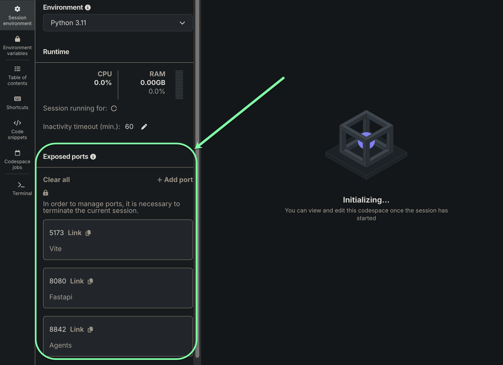

<p align="center">
  <a href="https://github.com/datarobot-community/talk-to-my-docs-agents">
    
  </a>
</p>
<p align="center">
    <span style="font-size: 1.5em; font-weight: bold; display: block;">DataRobot Talk to My Docs template</span>
</p>

<p align="center">
  <a href="https://datarobot.com">Homepage</a>
  ·
  <a href="https://docs.datarobot.com/en/docs/workbench/wb-apps/app-templates/at-talk-docs.html">DataRobot documentation</a>
  ·
  <a href="#quick-start">Getting started</a>
  ·
  <a href="https://docs.datarobot.com/en/docs/get-started/troubleshooting/general-help.html">Support</a>
</p>

<p align="center">
  <a href="https://app.datarobot.com/usecases/application-templates/689271200900e0f8cce1f264?referrerUrl=github">
    
  </a>
  <a href="https://app.eu.datarobot.com/usecases/application-templates/689271200900e0f8cce1f264?referrerUrl=github">
    
  </a>
  <a href="https://app.jp.datarobot.com/usecases/application-templates/689271200900e0f8cce1f264?referrerUrl=github">
    
  </a>
  <a href="https://app.jp.datarobot.com/usecases/application-templates/689271200900e0f8cce1f264?referrerUrl=github">
    
  </a>
  <a href="https://github.com/datarobot-community/talk-to-my-docs-agents/tags">
    
  </a>
  <a href="/LICENSE.txt">
    
  </a>
</p>

# Talk to My Docs

Talk to My Docs is a modular application template for building, developing, and deploying an AI-powered application. \
It features multi-agent orchestration, modern web frontends, and robust infrastructure-as-code to dynamically interact \
with your documents across different providers such as Google Drive, Box, SharePoint, and your local computer.

> [!WARNING]
> This template is a starting point. You must adapt it for your business requirements before deploying to production.

## Table of contents

1. [Quick start](#quick-start)
2. [Development workflow](#development-workflow)
3. [Deployment](#deployment)
4. [Air-gapped deployment](#air-gapped-deployment)
5. [Architecture overview](#architecture-overview)
6. [Change the LLM](#change-the-llm)
7. [Web configuration](#web-configuration)
8. [OAuth applications](#oauth-applications)
9. [Subproject documentation](#subproject-documentation)
10. [Advanced usage](#advanced-usage)
11. [Using DR CLI](#using-dr-cli)
12. [Additional resources](#additional-resources)

## 🚀 Quick start

This section outlines how to get started with the Talk to My Docs application template.

### Build in a DataRobot codespace

If you’re using a DataRobot codespace, everything you need is already installed. You can get the entire application running in just a few minutes using the `dr` CLI.

#### Quick start (recommended)

The fastest way to get started is to run:

```sh
dr start
```

This command will automatically:

- Update the DataRobot CLI (`dr self update`).
- Prepare the environment file if needed (`dr dotenv setup --if-needed`).
- Install all dependencies (`task install`).
- Start the required infrastructure (`task infra:start`).

Once it completes, you’re ready to begin development.

You’ll see a confirmation message like:

```
✅ You are all set. Run `task dev` to start developing, or run `task deploy` to deploy to DataRobot.
```

#### Environment configuration (optional)

If you prefer to set things up manually, or want to customize values:

1. Rename `.env.template` to `.env`

2. Open `.env` and fill in these required values (anything simple is fine for local use):

- `PULUMI_CONFIG_PASSPHRASE=1234abc` Enter a pulumi passphrase (can be anything, such as 1234)
- `SESSION_SECRET_KEY=1234abc` session secret (can be anything, such as 1234)

All `task` commands automatically read from `.env`.
If you need these variables available directly in your shell, run:

```sh
set -a && source .env && set +a
```

#### Deploy everything manually (advanced)

If you are not using `dr start`, you can install and deploy manually:

```sh
task install && task deploy-dev
```

> [!IMPORTANT]
> To access your application services from your browser, you must expose the required ports in your DataRobot codespace.
>
> 1. Open the "Session Environment" tab in your codespace.
> 2. In the "Exposed Ports" section, add the following ports:
>    - **5173** (frontend)
>    - **8080** (application server)
>    - **8842** (agent server)

### Build on your local machine

Follow the steps below to set up your local development environment.

#### Install the DataRobot CLI

> [!NOTE]
> If DataRobot CLI is already installed, you can skip this section.

Follow the installation instructions at: https://github.com/datarobot-oss/cli?tab=readme-ov-file#installation

#### Install Pulumi

> [!NOTE]
> If Pulumi is already installed, you can skip this section.

Follow the installation instructions in the Pulumi [documentation](https://www.pulumi.com/docs/iac/download-install/).
After installing for the first time, **restart your terminal** and run:

```sh
pulumi login --local      # omit --local to use Pulumi Cloud (requires an account)
```

#### Clone the repository

Run the following commands to clone the repository and navigate to the project directory:

```sh
git clone https://github.com/datarobot-community/talk-to-my-docs-agents
cd talk-to-my-docs-agents
```

#### Quick start (recommended)

The easiest way to set up and start developing locally is to run:

```sh
dr start
```

Once it completes, you’re ready to begin development.

#### Environment configuration (optional)

If you want to configure the environment manually or customize values:

1. Rename `.env.template` to `.env`
2. Open `.env` and set the required values:

```sh
DATAROBOT_API_TOKEN=...             # Required.
DATAROBOT_ENDPOINT=...              # Required. e.g. https://app.datarobot.com/api/v2

PULUMI_CONFIG_PASSPHRASE=...      # Required: Choose any alphanumeric passphrase for Pulumi config encryption
SESSION_SECRET_KEY=...            # Required: Random string used for Web app security
```

All `task` commands read from .env automatically.
If you need these variables available in your shell session:

**Linux/macOS:**

```sh
set -a && source .env && set +a
```

**Windows (PowerShell):**

```sh
Get-Content .env | ForEach-Object {
    if ($_ -match '^\s*([^#][^=]*)=(.*)$') {
        [System.Environment]::SetEnvironmentVariable($matches[1], $matches[2])
    }
}
```

#### Install and deploy manually (advanced)

If you prefer not to use dr start, you can install and deploy manually:

```sh
task install
task deploy-dev
```

**During the deploy step:**

- You will be asked to enter a stack name. Choose anything (e.g., dev).
- When prompted to update, select `Yes` using the arrow keys.

Once deployment finishes, a link to your application will appear in the terminal.
👉 **Click the link to open and use your app!**

### Prerequisites

If you are using DataRobot Codespaces, this is already complete for you. If not, install the following tools:

- [Python](https://www.python.org/downloads/) (3.11+ required for infrastructure and backend development)
- [Taskfile.dev](https://taskfile.dev/#/installation) (task runner)
- [uv](https://docs.astral.sh/uv/getting-started/installation/) (Python package manager)
- [Node.js](https://nodejs.org/en/download/) (JavaScript runtime for frontend development)
- [Pulumi](https://www.pulumi.com/docs/iac/download-install/) (infrastructure as code)

##### DataRobot codespace setup

If you are developing within a DataRobot codespace, the development ports must be exposed. You can check this in the "Exposed Ports" section of your "Session Environment" tab (pictured below). You should have the following ports exposed:

- 5173 (frontend)
- 8080 (application server)
- 8842 (agent server)

This should be automatically enabled if you created this application template from the gallery, otherwise (e.g. if cloned) configure these ports manually. There is a link next to the port to a URL where the service can be accessed when running locally in the codespace.



#### Example installation commands

For the latest and most accurate installation instructions for your platform, visit:

- https://www.python.org/downloads/
- https://taskfile.dev/installation/
- https://docs.astral.sh/uv/getting-started/installation/
- https://nodejs.org/en/download/
- https://www.pulumi.com/docs/iac/download-install/

See the instructions below to save you a context flip, but your system may not meet the common expectations from these shortcut scripts.

**macOS:**

<br>
macOS users can install the prerequisite tools using Homebrew. First, install Homebrew if you don't already have it.

```sh
/bin/bash -c "$(curl -fsSL https://raw.githubusercontent.com/Homebrew/install/HEAD/install.sh)" # If homebrew is not already installed
```

Then, install the prerequisite tools with it:

```sh
brew install datarobot-oss/taps/dr-cli uv pulumi/tap/pulumi go-task node git python
```

**Linux (Debian/Ubuntu/DataRobot Codespaces):**

```sh
# Python
sudo apt-get update
sudo apt-get install -y python3 python3-pip python3-venv
# Taskfile.dev
sh -c "$(curl --location https://taskfile.dev/install.sh)" -- -d -b ~/.local/bin
# uv
curl -Ls https://astral.sh/uv/install.sh | sh
# Node.js
curl -fsSL https://deb.nodesource.com/setup_lts.x | sudo -E bash -
sudo apt-get install -y nodejs
# Pulumi
curl -fsSL https://get.pulumi.com | sh
```

**Windows (PowerShell):**

```powershell
# Python
winget install --id=Python.Python.3.12 -e
# Taskfile.dev
winget install --id=Task.Task -e
# uv
winget install --id=astral-sh.uv  -e
# Node.js
winget install --id=OpenJS.NodeJS -e
# Pulumi
winget install pulumi
winget upgrade pulumi
# Windows Developer Tools
winget install Microsoft.VisualStudio.2022.BuildTools --force --override "--wait --passive --add Microsoft.VisualStudio.Component.VC.Tools.x86.x64 --add Microsoft.VisualStudio.Component.Windows11SDK.22621"

# For Windows 10/11, toggle Developer Mode to "On" under System > For developer to enable symbolic link
# Additionally, we use symlinks in the repo. Please set
git config --global core.symlink true
# Alternatively, you can do it for just this repo by omitting the --global and running this in the repo.
```

### Pulumi login

Pulumi requires a location to store the state of the application template. The easiest option is to
run:

```
pulumi login --local
```

Using a shared backend like Ceph, Minio, S3, or Azure Blob Storage is recommended. See
[Managing Pulumi State and Backends](https://www.pulumi.com/docs/iac/concepts/state-and-backends/) for
more details. For production CI/CD information see our comprehensive
[CI/CD Guide for Application Templates](https://docs.datarobot.com/en/docs/workbench/wb-apps/app-templates/pulumi-tasks/cicd-tutorial.html)

## Development workflow

All subprojects use [Taskfile.dev](https://taskfile.dev/#/installation) for common tasks. See each subproject’s README for details.

### Getting started

To get started, run:

```sh
task install
task deploy-dev
```

This will install all dependencies for each component, and deploy the backend LLM which sets you up
for local/codespace development.

To get the three components running locally (the agent, backend web, and frontend web server),
you can run the following command:

```sh
task dev
```

If you want to work on each one separately, you can run each one on its own, as described in the following sections.

#### Running the agent locally

```sh
task agent_retrieval_agent:dev
```

#### Running the frontend

```sh
task frontend_web:dev
```

#### Running the backend

```sh
task web:dev
```

Running the web backend with a deployed agent:

```sh
task web:dev
```

## Deployment

Infrastructure is managed with Pulumi. To deploy:

```sh
task deploy
```

Or, for manual control:

```sh
set -a && source .env && set +a
cd infra
uv run pulumi stack init <your-stack-name>
uv run pulumi up
```

There are also several shortcut tasks in that `task infra:` component such as only
deploying the backing LLM, getting stack info, or changing your stack if you have multiple stacks.

## Air-Gapped Deployment

This template supports using pre-configured execution environments (e.g., for deploying in air-gapped (offline) environments without internet access). Contact your DataRobot administrator or field engineering team for guidance on deploying in restricted network environments.

### Custom execution environment support

The application supports deployment with custom execution environments for both the web application and agent components:

**Web application environment:**

- Set `DATAROBOT_WEB_APP_EXECUTION_ENVIRONMENT_ID` in your `.env` file
- When configured, the application will use your specified execution environment instead of the default

**Agent environment:**

- Set `DATAROBOT_AGENT_EXECUTION_ENVIRONMENT_ID` in your `.env` file
- Alternatively, Pulumi can automatically handle agent environment creation if `docker_context.tar.gz` is present

**Configuration example:**

```bash
# In your .env file
DATAROBOT_WEB_APP_EXECUTION_ENVIRONMENT_ID=<your-web-env-id>
DATAROBOT_AGENT_EXECUTION_ENVIRONMENT_ID=<your-agent-env-id>
```

**Deployment example:**

```bash
# Deploy with custom execution environments
task infra:deploy
```

When using custom execution environments, Pulumi will:

- Use your specified environments instead of defaults
- Skip build script execution (dependencies already in environment)
- Upload application code directly for deployment

## Architecture overview

This template is organized into modular components:

- **agent_retrieval_agent/**: Multi-agent orchestration and core agent logic using CrewAI for complex processing and capabilities with you documents ([README](agent_retrieval_agent/README.md))
- **core/**: Shared Python core logic ([README](core/README.md))
- **frontend_web/**: React + Vite web frontend ([README](frontend_web/README.md))
- **web/**: FastAPI backend ([README](web/README.md))
- **infra/**: Pulumi infrastructure-as-code


Each component can be developed and deployed independently or as part of the full stack.

## Change the LLM

Talk to My Docs supports multiple flexible LLM options including:

- LLM Blueprint with LLM Gateway (default)
- LLM Blueprint with an External LLM
- Registered model such as an NVIDIA NIM
- Already Deployed Text Generation model in DataRobot

### LiteLLM usage

This project uses LiteLLM as a unified interface for LLMs. LiteLLM supports DataRobot natively and verifies that your setup works correctly. When a model name is prefixed with datarobot/, LiteLLM checks the DataRobot-supported model. If you use an external provider, the prefix reflects that instead (e.g., azure/gpt-4o).

### LLM configuration recommended option

You can edit the LLM configuration by manually changing which configuration is active.
Simply run:

```sh
ln -sf ../configurations/<chosen_configuration> infra/infra/llm.py
```

After doing so, you'll likely want to edit the llm.py to have the correct model selected. Particularly
for non-LLM Gateway options.

### LLM configuration alternative option

If you want to do it dynamically, you can set it as a configuration value with:

```sh
INFRA_ENABLE_LLM=<chosen_configuration>
```

from the list of options in the `infra/configurations/llm` folder.

Here are some examples of each configuration using the dynamic option described above:

#### LLM Blueprint with LLM Gateway (default)

Default option is LLM Blueprint with LLM Gateway if not specified in your `.env` file.

```sh
INFRA_ENABLE_LLM=blueprint_with_llm_gateway.py
```

#### Existing LLM deployment in DataRobot

Uncomment and configure these in your `.env` file:

```sh
LLM_DEPLOYMENT_ID=<your_deployment_id>
INFRA_ENABLE_LLM=deployed_llm.py
LLM_DEFAULT_MODEL=<your llm_default_model>
```

For more details, see [Configure LLM_DEFAULT_MODEL](#configure-llm_default_model)

#### Registered model with LLM Blueprint

Like an NVIDIA NIM. This also shows how you can adjust the timeout in case getting a GPU takes a long time:

```sh
DATAROBOT_TIMEOUT_MINUTES=120
TEXTGEN_REGISTERED_MODEL_ID='<Your Registered Model ID>'
INFRA_ENABLE_LLM=registered_model.py
```

#### External LLM provider

Configure an LLM with an external LLM provider like Azure, Bedrock, Anthropic, or VertexAI. Here's an Azure AI example:

```sh
INFRA_ENABLE_LLM=blueprint_with_external_llm.py
OPENAI_API_VERSION='2024-08-01-preview'
OPENAI_API_BASE='https://<your_custom_endpoint>.openai.azure.com'
OPENAI_API_DEPLOYMENT_ID='<your deployment_id>'
OPENAI_API_KEY='<your_api_key>'
```

See the [DataRobot documentation](https://docs.datarobot.com/en/docs/gen-ai/playground-tools/deploy-llm.html) for details on other providers.

In addition to the changes for the `.env` file, you can also edit the respective llm.py file to make additional changes
such as the default LLM, temperature, top_p, etc within the chosen configuration

#### Configure LLM_DEFAULT_MODEL

If you want to use a different default model for configuration testing, you can update it either by setting `LLM_DEFAULT_MODEL` before deploying or by changing the hardcoded `default_model` in `infra/infra/llm.py`.
Supported external prefixes: `azure`, `bedrock`, `vertex_ai`, `anthropic`.

```sh
LLM_DEFAULT_MODEL="azure/gpt-4o-mini"  # Example for Azure OpenAI
```

The full list of supported model names is available in the LLM Gateway catalog:
https://app.datarobot.com/api/v2/genai/llmgw/catalog/

## Web configuration

The web component is one of the more complex components and requires
additional configuration such as setting up a SQLAlchemy asyncio
compatible [database](web/README.md#database-configuration) and [OAuth providers](web/README.md#oauth-applications) to integrate documents from third-party document stores.

## OAuth applications

The template can work with files stored in Google Drive, Box, and SharePoint.
In order to give it access to those files, you need to configure OAuth applications.

### Google OAuth application

- Go to [Google API Console](https://console.developers.google.com/) from your Google account
- Navigate to "APIs & Services" > "Enabled APIs & services" > "Enable APIs and services", search for "Drive", and add it.
- Navigate to "APIs & Services" > "OAuth consent screen" and make sure you have your consent screen configured. You may have both "External" and "Internal" audience types.
- Navigate to "APIs & Services" > "Credentials" and click on the "Create Credentials" button. Select "OAuth client ID".
- Select "Web application" as Application type, fill in "Name" & "Authorized redirect URIs" fields. For example, for local development, the redirect URL will be:
  - `http://localhost:5173/oauth/callback` - local vite dev server (used by frontend folks)
  - `http://localhost:8080/oauth/callback` - web-proxied frontend
  - `http://localhost:8080/api/v1/oauth/callback/` - the local web API (optional).
  - For production, you'll want to add your DataRobot callback URL. For example, in US Prod it is `https://app.datarobot.com/custom_applications/{appId}/oauth/callback`. For any installation of DataRobot it is `https://<datarobot-endpoint>/custom_applications/{appId}/oauth/callback`.
- Hit the "Create" button when you are done.
- Copy the "Client ID" and "Client Secret" values from the created OAuth client ID and set them in the template env variables as `GOOGLE_CLIENT_ID` and `GOOGLE_CLIENT_SECRET` correspondingly.
- Make sure you have the "Google Drive API" enabled in the "APIs & Services" > "Library" section. Otherwise, you will get 403 errors.
- Finally, go to "APIs & Services" > "OAuth consent screen" > "Data Access" and make sure you have the following scopes selected:
  - `openid`
  - `https://www.googleapis.com/auth/userinfo.email`
  - `https://www.googleapis.com/auth/userinfo.profile`
  - `https://www.googleapis.com/auth/drive.readonly`

### Box OAuth application

- Head to [Box Developer Console](https://app.box.com/developers/console) from your Box account
- Create a new platform application, then select "Custom App" type
- Fill in "Application Name" and select "Purpose" (e.g. "Integration"). Then, fill in three more info fields. The actual selection doesn't matter.
- Select "User Authentication (OAuth 2.0)" as Authentication Method and click on the "Create App" button
- In the "OAuth 2.0 Redirect URIs" section, please fill in callback URLs you want to use.
  - `http://localhost:5173/oauth/callback` - local vite dev server (used by frontend folks)
  - `http://localhost:8080/oauth/callback` - web-proxied frontend
  - `http://localhost:8080/api/v1/oauth/callback/` - the local web API (optional).
  - For production, you'll want to add your DataRobot callback URL. For example, in US Prod it is `https://app.datarobot.com/custom_applications/{appId}/oauth/callback`.
- Hit "Save Changes" after that.
- Under the "Application Scopes", please make sure you have both `Read all files and folders stored in Box` and "Write all files and folders stored in Box" checkboxes selected. You need both because the script needs to write to the log that you've downloaded the selected files.
- Finally, under the "OAuth 2.0 Credentials" section, you should be able to find your Client ID and Client Secret pair to setup in the template env variables as `BOX_CLIENT_ID` and `BOX_CLIENT_SECRET` correspondingly.

### SharePoint OAuth application (Microsoft Entra ID)

SharePoint integration uses Microsoft Entra ID (formerly Azure AD) for authentication and **requires the authlib OAuth implementation** (`OAUTH_IMPL=authlib`).

This template supports both:
- **Azure OAuth (Delegated access)** - Users authenticate with their own Microsoft account to access SharePoint sites they have permission to view
- **Azure Service Principal (App-only access)** - Application accesses SharePoint on behalf of the organization (backend/automation scenarios)

#### Setup steps

1. Go to [Microsoft Entra admin center](https://entra.microsoft.com/) or [Azure Portal](https://portal.azure.com/)
2. Navigate to "Identity" > "Applications" > "App registrations" and click "New registration"
3. Fill in:
   - **Name**: e.g., "Talk to My Docs SharePoint"
   - **Supported account types**: Select based on your needs (typically "Accounts in this organizational directory only")
   - **Redirect URI**: Select "Web" and add your callback URLs:
     - `http://localhost:5173/oauth/callback` - local vite dev server
     - `http://localhost:8080/oauth/callback` - web-proxied frontend
     - For production: `https://app.datarobot.com/custom_applications/{appId}/oauth/callback`
4. Click "Register"

#### Configure API permissions

Navigate to "API permissions" and add the following:

**For Delegated access (user-based):**
- Microsoft Graph > Delegated permissions:
  - `openid`
  - `email`
  - `profile`
  - `User.Read`
  - `Sites.Read.All`
  - `offline_access` (for refresh tokens)

**For App-only access (service principal):**
- Microsoft Graph > Application permissions:
  - `Sites.Read.All`

After adding permissions, click "Grant admin consent for [Your Organization]".

#### Create client secret

1. Navigate to "Certificates & secrets" > "Client secrets"
2. Click "New client secret", add a description, and set expiration
3. Copy the secret **Value** immediately (it won't be shown again)

#### Configure environment variables

Copy the values from Azure and set them in your `.env` file:
- **SHAREPOINT_CLIENT_ID**: Application (client) ID from the "Overview" page
- **SHAREPOINT_CLIENT_SECRET**: The client secret value you just created
- **SHAREPOINT_TENANT_ID**: Directory (tenant) ID from the "Overview" page

```bash
SHAREPOINT_CLIENT_ID=your-client-id
SHAREPOINT_CLIENT_SECRET=your-client-secret
SHAREPOINT_TENANT_ID=your-tenant-id

# Required for SharePoint OAuth
OAUTH_IMPL=authlib
```

#### Using SharePoint OAuth

Since SharePoint uses the authlib implementation, ensure your application is configured with:
```bash
OAUTH_IMPL=authlib
```

After you've set those in your project `.env` file, on the next Pulumi Up, OAuth providers will be created in your DataRobot installation (Google and Box only). To view and manage them and verify they are working,
navigate to `<your_datarobot_url>/account/oauth-providers`.

Additionally, the Pulumi output variables are used to populate those providers for your codespace and local development environment as well.

## Subproject documentation

- [Agent Retrieval Agent](agent_retrieval_agent/README.md)
- [Core](core/README.md)
- [Frontend web](frontend_web/README.md)
- [Web (FastAPI)](web/README.md)

## Advanced usage

- Customize environment variables in `.env`
- Extend agents or add new tools in `agent_retrieval_agent/`
- Add or modify frontend components in `frontend_web/`
- Update infrastructure in `infra/`

## Additional resources

- [Taskfile.dev Documentation](https://taskfile.dev/#/)
- [Pulumi Documentation](https://www.pulumi.com/docs/)
- [Vite Documentation](https://vitejs.dev/)
- [FastAPI Documentation](https://fastapi.tiangolo.com/)
- [DR CLI](https://github.com/datarobot-oss/cli)
- [Local tracing setup](LOCAL_TRACING.md)

For more details, see the README in each subproject.
